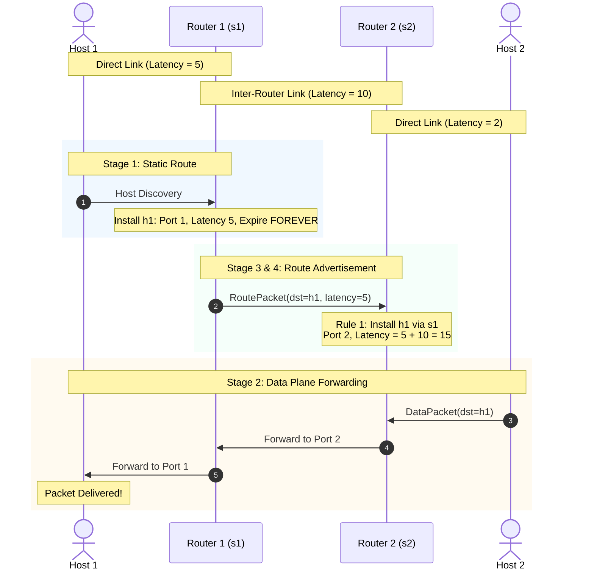
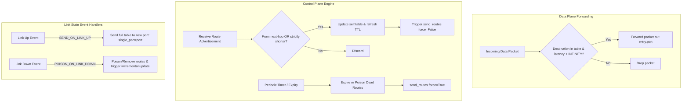

# CS168 Distance-Vector Routing

[](https://www.python.org/downloads/)
[](https://fa26.cs168.io/)
[](#testing--quality)
[](LICENSE)

> A robust, full-featured Python implementation of a distributed Distance-Vector routing protocol engine based on the Bellman-Ford algorithm, featuring dynamic topology discovery, loop prevention (Split Horizon & Poison Reverse), count-to-infinity mitigation, route poisoning, and event-driven triggered incremental updates.

---

## Table of Contents
- [Features](#features)
- [Architecture & How It Works](#architecture--how-it-works)
- [Getting Started](#getting-started)
- [Usage](#usage)
- [Protocol Mechanics & Loop Prevention](#protocol-mechanics--loop-prevention)
- [Testing & Quality](#testing--quality)
- [Project Structure](#project-structure)
- [License](#license)

---

## Features

- **Distributed Bellman-Ford Engine**: Dynamic least-cost path computation and forwarding table updates across arbitrary network graphs.
- **Path Stability Tiebreaking**: Deterministically prefers current next-hop paths on metric ties to eliminate forwarding oscillations and packet reordering.
- **Multi-Layer Loop Prevention**:
  - **Split Horizon**: Suppresses route advertisements back out the ingress interface to eliminate length-2 loops.
  - **Poison Reverse**: Actively advertises metric $\infty$ ($100$) back to the next hop to accelerate loop breaking.
  - **Count-to-Infinity Clamping**: Metric saturation ceiling preventing indefinite counting cycles during network partition.
- **Route Expiration & Dead Link Poisoning**: Ages out stale routes using a 15-second TTL and actively broadcasts poisoned metrics to flush downstream routing state.
- **Triggered Incremental Updates**:
  - Delta-only incremental broadcasts caching prior advertisements per-port/per-destination to minimize control-plane overhead.
  - Dynamic link up/down event hooks for immediate sub-second network convergence.

---

## Architecture & How It Works

Routers asynchronously exchange distance-vector advertisements (`RoutePacket`) containing estimated latencies to all reachable destination hosts. Forwarding tables map host destinations to physical output ports.



### Forwarding & Control Plane Pipeline



---

## Getting Started

### Prerequisites

- **Python**: Python 3.8, 3.10, 3.11, or newer.
- **Operating System**: Linux, macOS, or Windows (via WSL2).
- **Web Browser** *(Optional)*: For the interactive network visualizer UI.

### Installation

```bash
# Clone the repository
git clone https://github.com/durgesh-k-sharma/cs168-fa26-proj2-routing.git
cd cs168-fa26-proj2-routing
```

---

## Usage

All simulation commands are run from the `simulator/` directory:

```bash
cd simulator
```

### 1. Launching Topologies in the Simulator

```bash
# Linear topology (2 routers, 2 hosts)
python3 simulator.py --default-switch-type=dv_router.DVRouter topos.linear

# Linear topology with custom count (e.g. 3 routers, 3 hosts)
python3 simulator.py --default-switch-type=dv_router.DVRouter topos.linear --n=3

# Square topology (multi-path routing)
python3 simulator.py --default-switch-type=dv_router.DVRouter topos.square

# Candy topology (fault-tolerant topology)
python3 simulator.py --default-switch-type=dv_router.DVRouter topos.candy

# Loopy topology (loop mitigation demonstration)
python3 simulator.py --default-switch-type=dv_router.DVRouter topos.loopy

# Double triangle topology
python3 simulator.py --default-switch-type=dv_router.DVRouter topos.double_triangle
```

Access the interactive visualizer in your browser at `http://127.0.0.1:4444`.

### 2. Interactive Simulator CLI

```python
# Send a ping from host h1 to host h2
h1.ping(h2)

# View forwarding table of router s1
s1.table

# Disconnect link between s1 and s2 to test dynamic convergence
s1.unlinkTo(s2)
```

---

## Protocol Mechanics & Loop Prevention

The implementation fulfills all 10 stages and safety specifications of the distance-vector protocol:

| Stage | Mechanism | Description | Solution / Rule |
|---|---|---|---|
| **Stage 1** | Static Routes | Host Discovery | Installs `latency = link_lat` and `expire_time = FOREVER` on direct host attachment. |
| **Stage 2** | Forwarding | Packet Forwarding | Checks `dst` existence and ensures `latency < INFINITY` before routing to `entry.port`. |
| **Stage 3** | Advertising | Periodic Broadcast | Sends `RoutePacket` advertisements for all table entries out active interfaces. |
| **Stage 4** | Route Merging | Bellman-Ford Updates | Adopts updates unconditionally from next-hop (Rule 2) or when discovering strictly shorter paths (Rule 1). |
| **Stage 5** | Route Aging | Timeout Handling | Removes expired dynamic routes from forwarding table after `ROUTE_TTL = 15s`. |
| **Stage 6** | Loop Breaking | Split Horizon | Omits route advertisements back out the interface from which the route was learned (`SPLIT_HORIZON`). |
| **Stage 7** | Loop Breaking | Poison Reverse | Advertises `INFINITY` back to the next-hop interface (`POISON_REVERSE`). |
| **Stage 8** | Metric Saturation | Count-to-Infinity | Clamps all metrics $> \text{INFINITY}$ to $\text{INFINITY} = 100$, bounding count cycles. |
| **Stage 9** | Failure Signaling | Poison Expired Routes | Replaces timed-out routes with `latency = INFINITY, expire_time = FOREVER` (`POISON_EXPIRED`). |
| **Stage 10A** | Optimization | Triggered & Incremental | Caches `(port, dst)` history to broadcast delta updates immediately upon table mutation. |
| **Stage 10B** | Fast Convergence | Link Up / Link Down | Immediately sends updates out newly connected links or poisons broken paths on link failure. |

---

## Testing & Quality

### Automated Unit Test Suite
Execute the 10-stage unit test harness:

```bash
cd simulator
python3 dv_unit_tests.py
```

### Stage-Specific Validation
```bash
python3 dv_unit_tests.py 1   # Stage 1: Static Routes
python3 dv_unit_tests.py 2   # Stage 2: Forwarding
python3 dv_unit_tests.py 4   # Stage 4: Merging & Bellman-Ford
python3 dv_unit_tests.py 6   # Stage 6: Split Horizon
python3 dv_unit_tests.py 7   # Stage 7: Poison Reverse
python3 dv_unit_tests.py 10  # Stage 10: Incremental Triggered Updates
```

### Test Results Summary

| Stage | Test Suite | Tests | Result |
|---|---|---|---|
| Stage 0 | Starter Code Sanity | 3 / 3 | ✅ Passed |
| Stage 1 | Static Routes Installation | 1 / 1 | ✅ Passed |
| Stage 2 | Data Packet Forwarding | 4 / 4 | ✅ Passed |
| Stage 3 | Periodic Route Advertisements | 1 / 1 | ✅ Passed |
| Stage 4 | Route Merging (Bellman-Ford & Next-Hop) | 8 / 8 | ✅ Passed |
| Stage 5 | Timeout & Expiry Management | 4 / 4 | ✅ Passed |
| Stage 6 | Split Horizon Loop Prevention | 1 / 1 | ✅ Passed |
| Stage 7 | Poison Reverse Acceleration | 1 / 1 | ✅ Passed |
| Stage 8 | Counting-to-Infinity Clamping | 3 / 3 | ✅ Passed |
| Stage 9 | Expired Route Poisoning | 5 / 5 | ✅ Passed |
| Stage 10 | Triggered & Incremental Updates | 31 / 31 | ✅ Passed |
| **Total** | **Full Protocol Test Suite** | **31 / 31** | **100.00 / 100.00** |

---

## Project Structure

```text
.
├── netvis/                             # Web-based visualization client
├── simulator/                          # Simulator framework & protocol logic
│   ├── dv_router.py                    # Main Distance Vector router implementation
│   ├── dv_unit_tests.py                # Comprehensive 10-stage unit test harness
│   ├── dv_comprehensive_test.py        # End-to-end randomized network test suite
│   ├── cs168/                          # Course base classes, data structures, and topologies
│   │   ├── dv.py                       # Base classes (Table, TableEntry, Ports, RoutePacket)
│   │   ├── linear.topo                 # Linear topology definition
│   │   ├── square.topo                 # Square topology definition
│   │   └── loopy4.topo                 # Loopy topology definition
│   ├── sim/                            # Core discrete-event network simulator engine
│   └── topos/                          # Extended network topologies (candy, star, etc.)
├── LICENSE                             # MIT License
├── .gitignore                          # Git ignore rules
└── README.md                           # Project documentation
```

---

## License

This project is part of UC Berkeley's CS 168 (Computer Networks) curriculum and is provided for educational and portfolio demonstration under the [MIT License](LICENSE).
